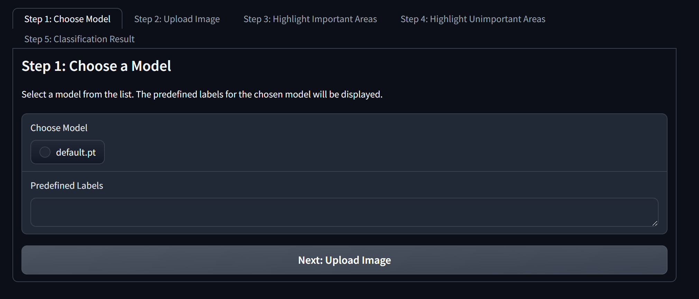
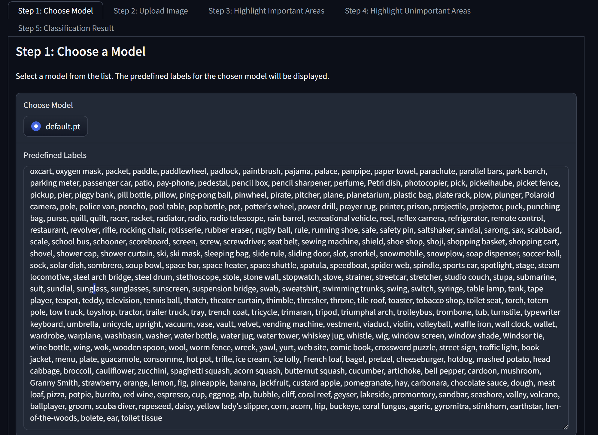
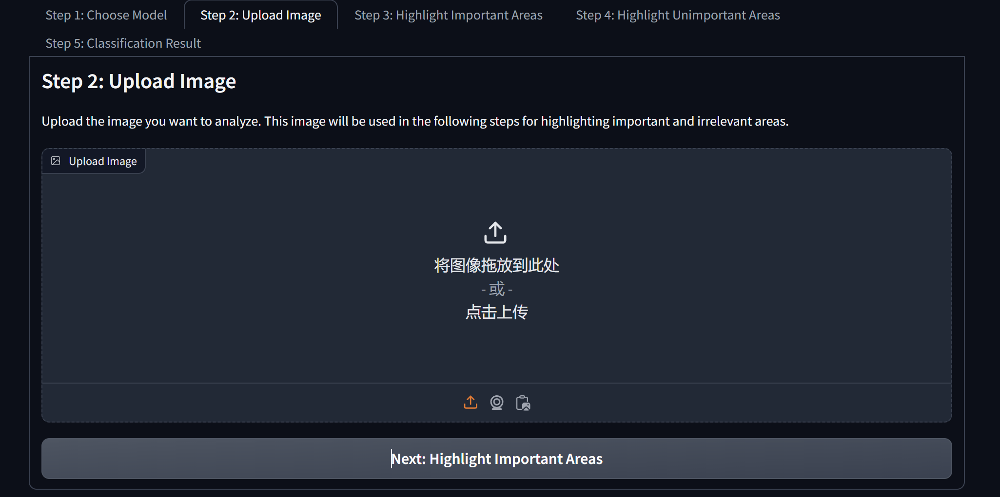
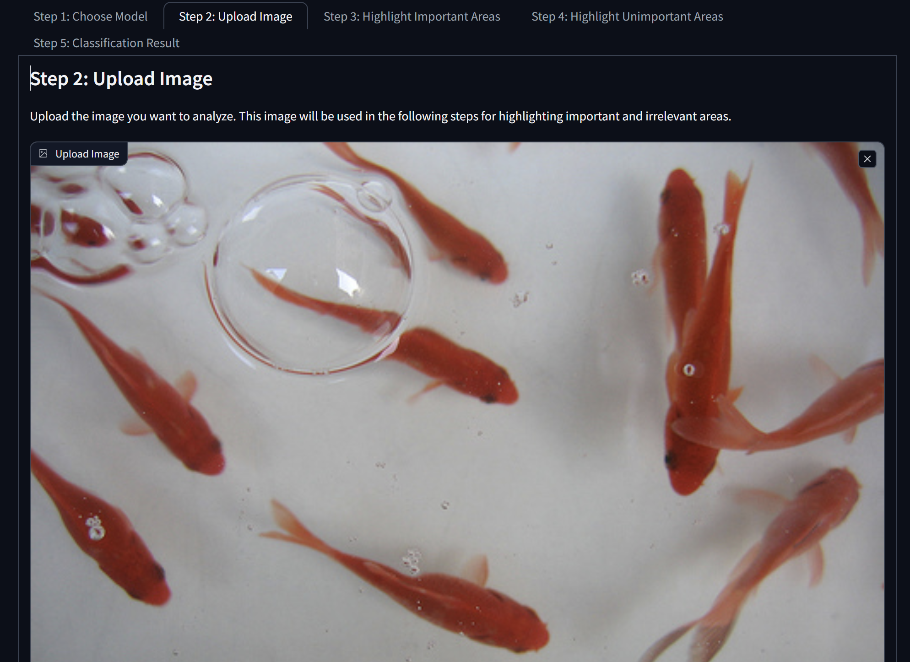
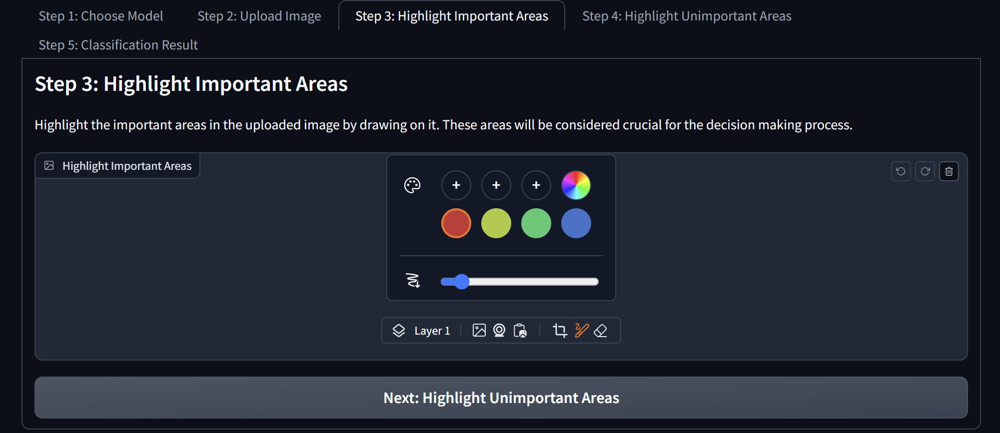
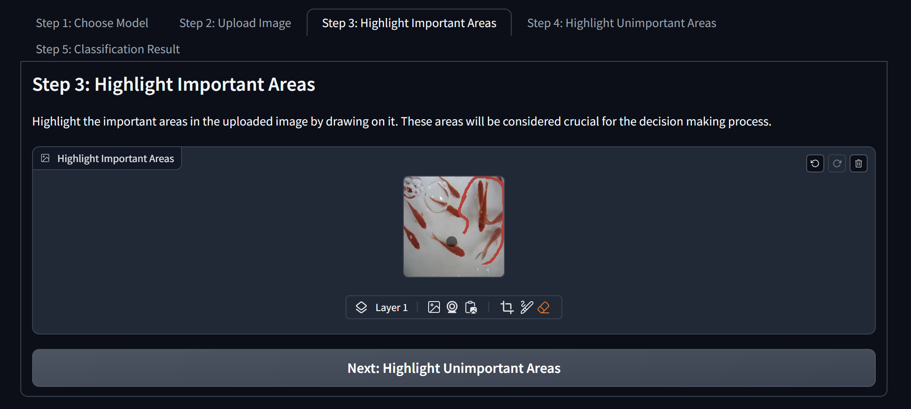
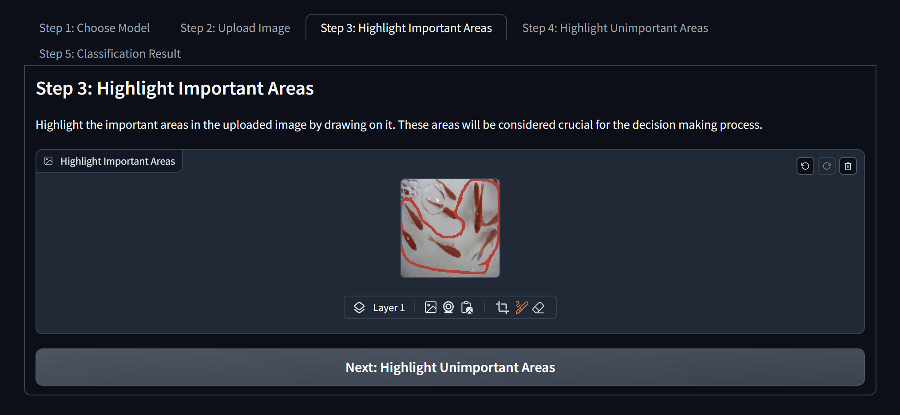
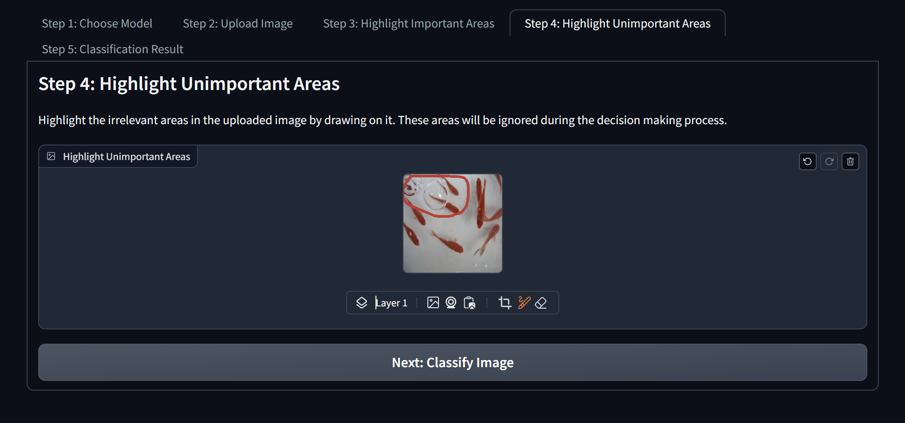
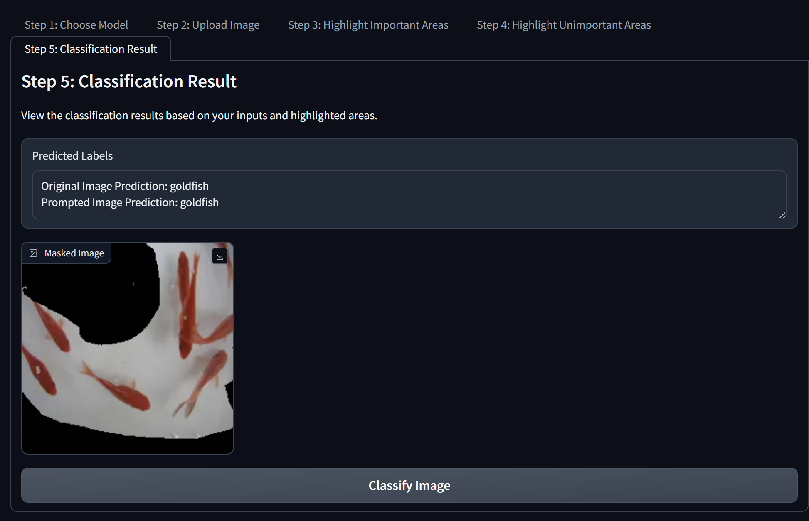

# Visual Attention Prompted Prediction and Learning

This repo includes the source code the developed tools for paper Visual Attention Prompted Prediction and Learning accepted by IJCAI 2024

Link to the demo of our developed UI for the application of the proposed method: <170.140.151.23>

## Features

- **Model Selection**: Choose from predefined models.
- **Image Upload**: Upload an image for analysis.
- **Highlighting Important Areas**: Draw on the image to highlight important areas.
- **Highlighting Unimportant Areas**: Draw on the image to highlight areas that should be ignored.
- **Classification Results**: View the classification results based on the inputs and highlighted areas.

## How to Use the App

### Step 1: Choose Model

1. **Select a Predefined Model**:
   - Choose a model from the list of available models.
   - The predefined labels for the selected model will be loaded and displayed automatically.

Fig 1: Select a predefined model from the list.

Fig 2: Predefined labels for the selected model.

<!-- 
2. **Or Upload Your Own Model**:
   - Upload a custom model file.
   - The app will handle and display labels accordingly. -->

2. **Proceed to the Next Step**:
   - Click the "Next: Upload Image" button to move to the next stage.

### Step 2: Upload Image

1. **Upload an Image**:
   - Use the "Upload Image" button to select and upload an image from your device.
   - The uploaded image will be used in subsequent steps for analysis.

Fig 3: Upload an image for analysis.

Fig 4: Uploaded image ready for highlighting.

2. **Proceed to the Next Step**:
   - Click the "Next: Highlight Important Areas" button to move to the next stage.

### Step 3: Highlight Important Areas

1. **Highlight Important Areas**:
   - Draw on the uploaded image to highlight important areas. These areas will be considered crucial for the analysis.

Fig 5: Highlight important areas in the image.

Fig 6: Draw on the image to mark important areas.

Fig 7: Important areas highlighted.

2. **Proceed to the Next Step**:
   - Click the "Next: Highlight Unimportant Areas" button to move to the next stage.

### Step 4: Highlight Unimportant Areas

1. **Highlight Unimportant Areas**:
   - Draw on the uploaded image to highlight unimportant areas. These areas will be ignored during the analysis.

Fig 8: Highlight unimportant areas in the image.

2. **Proceed to the Next Step**:
   - Click the "Next: Classify Image" button to move to the next stage.

### Step 5: Classification Result

1. **View Classification Results**:
   - The app will display the classification results based on your inputs and highlighted areas.

Fig 9: View classification results.

2. **Classify Image**:
   - Click the "Classify Image" button to perform the classification and view the results.

<!-- ## Additional Information

- **Predefined Labels**: The predefined labels for each model are displayed in the first step when a model is selected.
- **Custom Models**: If you upload your own model, ensure it is compatible with the app's requirements. -->

## Technical Details

This app is built using Gradio, a Python library for creating web interfaces for machine learning models. It leverages PyTorch for model handling and image processing.
